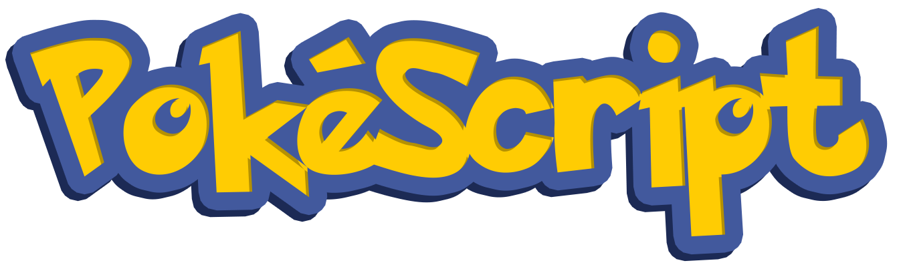

# [PokeScript](https://georgeh02.github.io/PokeScript/)

A compiler for the language PokeScript

Welcome to PokeScript, the language designed to help Pokemon trainers learn to code their very own PokeDex. Beginner trainers can quickly and easily implement their own PokeDex using PokeScripts features.

Created by George Harrison

## PokeScript Features

- Inspired by JavaScript and Python
- Pokemon Themed
- Static typing
- Object oriented
- Type Inference

## PokeTypes

<table>
    <tr>
        <th>Javascript</th>
        <th>PokeScript</th>
    </tr>
    <tr>
        <td>boolean</td>
        <td>capture (success/fail)</td>
    </tr>
    <tr>
        <td>String</td>
        <td>pokestring</td>
    </tr>
    <tr>
        <td>Number</td>
        <td>pokedollar (int)</td>
    </tr>
    <tr>
        <td>Number</td>
        <td>pokefloat (float)</td>
    </tr>
</table>

## Data Structures

<table>
    <tr>
        <th>JavaScript</th>
       <th>PokeScript</th>
    </tr>
    <tr>
        <td>Array</td>
        <td>pokelist</td>
    </tr>
    <tr>
        <td>Map</td>
        <td>pokedex</td>
    </tr>
</table>

## Examples

<table>
    <tr>
        <th>Javascript</th>
        <th>PokeScript</th>
    </tr>
    <tr>
        <td>
            <pre>
<code>console.log(“Hello world”)</code>
            </pre>
        </td>
        <td>
            <pre>
<code>pika “Hello world”</code>
            </pre>
        </td>
    </tr>
</table>

<table>
    <tr>
        <th>Javascript</th>
        <th>PokeScript</th>
    </tr>
    <tr>
        <td>
            <pre><code>
var x = 1
const x = 1
            </code></pre>
        </td>
        <td>
            <pre><code>
poke x = 1
const x = 5
            </code></pre>
        </td>
    </tr>
</table>

<table>
    <tr>
        <th>Javascript</th>
        <th>PokeScript</th>
    </tr>
    <tr>
        <td>
            <pre><code>
function add(a, b) {
    return a + b
}
            </code></pre>
        </td>
        <td>
            <pre><code>
ability add(pokedollar a, pokedollar b) {
    return a + b
}
            </code></pre>
        </td>
    </tr>
</table>

<table>
    <tr>
        <th>Javascript</th>
        <th>PokeScript</th>
    </tr>
    <tr>
        <td>
            <pre><code>
if (x == 5) {
    return 5
} else if (x == 4) {
    return 4
} else {
    return 2
}
            </code></pre>
        </td>
        <td>
            <pre><code>
catch x == 5 {
    pika 5
} release catch x == 4 {
    pika 4
} release {
    pika 2
}
            </code></pre>
        </td>
    </tr>
</table>

<table>
    <tr>
        <th>Javascript</th>
        <th>PokeScript</th>
    </tr>
    <tr>
        <td>
            <pre><code>
for (int x = 3, x < 5; x++) {
    break;
}
            </code></pre>
        </td>
        <td>
            <pre><code>
evolve pokedollar x = 3 until 5 {
    break
}
            </code></pre>
        </td>
    </tr>
</table>

<table>
    <tr>
        <th>Javascript</th>
        <th>PokeScript</th>
    </tr>
    <tr>
        <td>
            <pre><code>
while (true) {
    var x = 1
}
            </code></pre>
        </td>
        <td>
            <pre><code>
while success {
    poke x = 1
}
            </code></pre>
        </td>
    </tr>
</table>

<table>
    <tr>
        <th>Python</th>
        <th>PokeScript</th>
    </tr>
    <tr>
        <td>
            <pre><code>
dex = {
    "pikachu": 3,
    "charizard": 6,
    "snorlax": 8
}
            </code></pre>
        </td>
        <td>
            <pre><code>
{pokestring, pokedollar} dex = {"pikachu": 3, "charizard": 6, "snorlax": 8}
            </code></pre>
        </td>
    </tr>
</table>

<table>
    <tr>
        <th>Javascript</th>
        <th>PokeScript</th>
    </tr>
    <tr>
        <td>
            <pre><code>
class Pokemon {
    constructor(level, name) {
        this.level = level
        this.name = name
    }
    getLevel() {
        return this.level
    }
}
            </code></pre>
        </td>
        <td>
            <pre><code>
train Pokemon {
    starter(pokedollar level, pokestring name) {
        this.level = level
        this.name = name
    }
    getLevel() {
        return this.level
    }
}
            </code></pre>
        </td>
    </tr>
</table>

<table>
    <tr>
        <th>Javascript</th>
        <th>PokeScript</th>
    </tr>
    <tr>
        <td>
            <pre><code>
// comment
            </code></pre>
        </td>
        <td>
            <pre><code>
ϞϞ(๑⚈ ․̫ ⚈๑)∩ comment
            </code></pre>
        </td>
    </tr>
</table>

## Types of Semantic Errors

- Using non-initialized variables
- Bad types in all ternary, binary, and unary operations
- Bad types in data structures
- Bad type in reassignment of variable
- Bad type in declaration of variable
- Incorrect number of function params
- Breaking outside of loop
- Returning outside of function
- Function with return value doesn't return anything
- Calling a function or method that is not intialized
- For loop with non-integer iterator
